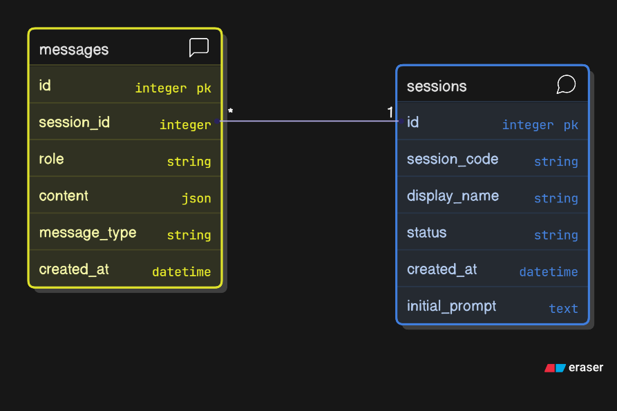

<div align="right" style="margin-top: 1rem;">
  <b>Author:</b>
  <a href="mailto:amr.emaish@gmail.com"> Amr Emaish </a>
</div>

# Computer Use App

A powerful AI agent that can interact with your computer through a web interface, capable of taking screenshots, running commands, editing files, and more. Built with FastAPI and Anthropic's Claude API.

## 👤 Author

- **Name**: Amr Emaish
- **Email**: amr.emaish@gmail.com
- **Experience**: Around 5+ years in backend engineering
- **LinkedIn**: [linkedin.com/in/amr-emaish](https://linkedin.com/in/amr-emaish)

## 🚀 Features

- **Real-time AI Agent Interaction**: Chat with an AI agent that can control your computer
- **Screenshot Capabilities**: Agent can take screenshots and analyze visual content
- **Command Execution**: Run terminal commands safely
- **WebSocket Communication**: Real-time updates and streaming responses
- **Session Management**: Persistent conversation history with database storage
- **VNC Integration**: Remote desktop access through noVNC
 

## 🎬 Demo

- Demo Video 1: [Watch here](https://drive.google.com/file/d/1bp0yZdsZqY1GNJgmC7FD-nSmJqHjdO9f/view)
- Demo Video 2: [Watch here](https://drive.google.com/file/d/1nObB3WYgVQP6otH258eSpVkz-1FuWh52/view)

Prompts used in Demo Video 1:

```text
Prompt 1:
Open the Office and create two columns: "First Name" and "Last Name". Then, add one row of data.

Prompt 2:
Open the calculator and calculate: 8 × 3.
```
- Prompts used in Demo Video 2:

```text
Prompt 1:
Search the weather in Dubai

Prompt 2:
Search the weather in San Francisco
```
- **Session Content Search**: Search past sessions by text content with a built-in UI modal and REST API

## 📋 Prerequisites

- Docker and Docker Compose
- Anthropic API key
- PostgreSQL (included in Docker setup)

## 🛠️ Quick Start

### 1. Clone the Repository

```bash
git clone <repository-url>
cd computer-use-demo
```

### 2. Set Up Environment Variables

```bash
cp env_template.txt .env
```

Edit `.env` file with your configuration:

```env
# API Configuration
ANTHROPIC_API_KEY=your_anthropic_api_key_here

# PostgreSQL Configuration
POSTGRES_DB=chat_sessions
POSTGRES_USER=computeruse
POSTGRES_PASSWORD=computeruse123
POSTGRES_PORT=5432
```

### 3. Run the Application

```bash
docker-compose up --build
```

### 4. Access the Application

Once the containers are running, you can access:

- **Main Application**: http://localhost:8080
- **VNC Desktop**: http://localhost:6080 (noVNC)
- **FastAPI App**: http://localhost:8081/

## 🧪 Tests

Run via Docker (single command):

```bash
docker compose build --pull computer-use-demo && \
docker compose run --rm --no-deps --entrypoint python computer-use-demo -m pytest -q
```

Examples:

```bash
# Specific file
docker compose run --rm --no-deps --entrypoint python computer-use-demo -m pytest -q tests/test_sessions_api.py

# By pattern
docker compose run --rm --no-deps --entrypoint python computer-use-demo -m pytest -q -k search_sessions
```

Notes:
- Tests use an in-memory SQLite database via FastAPI dependency override, so they do not touch your real Postgres.
- In CI, tests are executed inside Docker with an in-memory SQLite `DATABASE_URL`.

## 🏗️ Project Structure

```
computer-use-demo/
├── app/                          # Main application code
│   ├── api/v1/                   # API endpoints
│   │   ├── sessions.py           # Session management API
│   │   └── websocket.py          # WebSocket endpoints
│   ├── core/                     # Core configuration
│   │   ├── config.py             # Application settings
│   │   └── database.py           # Database connection
│   ├── models/                   # Database models
│   │   ├── session.py            # Session model
│   │   └── message.py            # Message model
│   ├── services/                 # Business logic
│   │   └── database_service.py   # Database operations
│   ├── tools/                    # Agent tools
│   │   ├── agentic_loop.py       # Main agent logic
│   └── main.py                   # FastAPI application
├── agent_dashboard/              # Desktop environment setup
├── docker-compose.yml            # Docker services configuration
├── Dockerfile                    # Application container
├── requirements.txt              # Python dependencies
└── entrypoint.sh                 # Container startup script
```

## Sequence Diagram

The following diagram shows the end-to-end flow between the browser UI, FastAPI backend, the agent, database, and the VNC stack.


## Entity Relationship Diagram (ERD)

The following diagram shows the database schema and relationships between sessions and messages.



## 📚 API Documentation

### Swagger and OpenAPI

- **Swagger UI**: [http://localhost:8081/api/docs](http://localhost:8081/api/docs)
- **ReDoc**: [http://localhost:8081/api/redoc](http://localhost:8081/api/redoc)
- **OpenAPI JSON**: [http://localhost:8081/api/openapi.json](http://localhost:8081/api/openapi.json)

Notes:
- The WebSocket endpoint is described in this README but is not part of the OpenAPI schema.

## 🔎 Using the Search UI

- Open the app at `http://localhost:8080`.
- Click the "Search Sessions" button in the sidebar.
- Type your query and press Enter or click the search icon.
- Click a result to open that session; the modal will close automatically.

Notes:
- Search operates on text blocks only (images are not searched).
- Results show at most one recent match per session.

## 🗃️ Database Notes

- Messages have a `message_type` enum (`text` or `image`).
- A lightweight migration runs on startup to ensure the enum type and `messages.message_type` column exist (PostgreSQL required). Existing rows are best-effort backfilled by detecting image blocks.

### Base URL
```
http://localhost:8081
```

### Authentication
Currently, the API doesn't require authentication. All endpoints are publicly accessible.

### REST API Endpoints

#### 1. Create Session
**POST** `/api/session`

Creates a new conversation session with the AI agent.

**Request Body:**
```json
{
  "session_name": "string (optional)",
  "display_name": "string (optional)", 
  "initial_prompt": "string (optional)"
}
```

**Response:**
```json
{
  "session_id": "uuid-string",
  "display_name": "string"
}
```

**Example:**
```bash
curl -X POST "http://localhost:8081/api/session" \
  -H "Content-Type: application/json" \
  -d '{
    "display_name": "My First Session",
    "initial_prompt": "Hello, can you help me with my computer?"
  }'
```

#### 2. Get Session Status
**GET** `/api/session/{session_id}`

Retrieves the current status and information of a session.

**Response:**
```json
{
  "session_id": "string",
  "display_name": "string",
  "status": "running|completed|error",
  "created_at": "datetime",
  "initial_prompt": "string"
}
```

**Example:**
```bash
curl "http://localhost:8081/api/session/4dccdad3-d809-473b-9bcf-1c7dfc095850"
```

#### 3. Get Session History
**GET** `/api/session/{session_id}/history`

Retrieves the complete conversation history for a session, including messages with images.

**Response:**
```json
{
  "session_id": "string",
  "display_name": "string",
  "status": "string",
  "created_at": "datetime",
  "initial_prompt": "string",
  "messages": [
    {
      "id": "integer",
      "role": "user|assistant",
      "content": [
        {
          "type": "text",
          "text": "string"
        },
        {
          "type": "image",
          "source": {
            "type": "base64",
            "media_type": "image/png",
            "data": "base64-encoded-image"
          }
        }
      ],
      "created_at": "datetime"
    }
  ]
}
```

**Example:**
```bash
curl "http://localhost:8081/api/session/4dccdad3-d809-473b-9bcf-1c7dfc095850/history"
```

#### 4. List All Sessions
**GET** `/api/sessions`

Retrieves a list of all available sessions.

**Response:**
```json
{
  "sessions": [
    {
      "session_id": "string",
      "display_name": "string",
      "status": "string",
      "created_at": "datetime",
      "message_count": "integer"
    }
  ]
}
```

**Example:**
```bash
curl "http://localhost:8081/api/sessions"
```

#### 5. Delete Session
**DELETE** `/api/session/{session_id}`

Deletes a session and all its associated messages.

**Response:**
```json
{
  "message": "Session {session_id} deleted successfully."
}
```

**Example:**
```bash
curl -X DELETE "http://localhost:8081/api/session/4dccdad3-d809-473b-9bcf-1c7dfc095850"
```

#### 6. Search Sessions by Text
**GET** `/api/sessions/search`

Search across message content (text blocks only) and return the most recent matching message per session.

Query Params:

- `q` (string, required): Text to search (case-insensitive substring)
- `limit` (int, optional, default 10, max 100): Max unique sessions to return

Response:

```json
{
  "results": [
    {
      "session_id": "string",
      "display_name": "string or null",
      "created_at": "datetime",
      "message_id": 123,
      "message_created_at": "datetime",
      "snippet": "Up to first 200 chars of matched text"
    }
  ]
}
```

Example:

```bash
curl "http://localhost:8081/api/sessions/search?q=install%20python&limit=10"
```

### WebSocket API

#### WebSocket Connection
**WebSocket** `/ws/session/{session_id}`

Establishes a real-time WebSocket connection for live communication with the AI agent.

**Connection:**
```javascript
const ws = new WebSocket(`ws://localhost:8081/ws/session/${sessionId}`);
```

**Message Types:**

1. **Agent Message** (text response from AI):
```json
{
  "type": "agent_message",
  "message": "string"
}
```

2. **Image** (screenshot or visual content):
```json
{
  "type": "image",
  "data": "base64-encoded-image"
}
```

3. **Thinking** (agent's thought process):
```json
{
  "type": "thinking",
  "message": "string"
}
```

4. **Error** (error messages):
```json
{
  "type": "agent_message",
  "message": "Error: error description"
}
```

**Sending Messages:**
```javascript
// Send a user message to the agent
ws.send(JSON.stringify({
  "message": "Take a screenshot of my desktop"
}));
```
## 📄 License

This project is licensed under the MIT License - see the [LICENSE](LICENSE) file for details.

## 🤝 Contributing

1. Fork the repository
2. Create a feature branch (`git checkout -b feature/amazing-feature`)
3. Commit your changes (`git commit -m 'Add some amazing feature'`)
4. Push to the branch (`git push origin feature/amazing-feature`)
5. Open a Pull Request